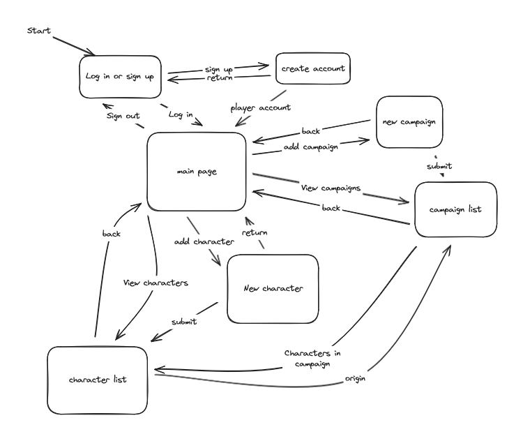
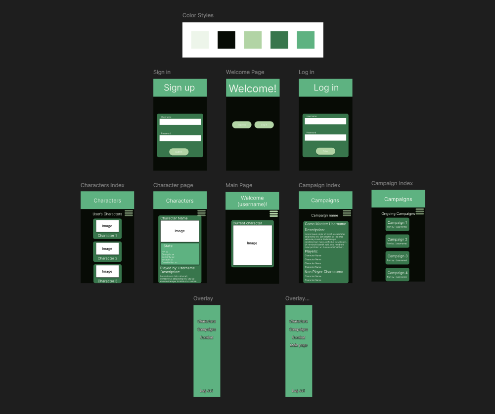

# Development of a Database-Driven Web Application for NCEA Level 3

Project Name: **Tabletop Character Index**

Project Author: **Cameron Fitzsimmons**

Assessment Standards: **91902** and **91903**

-------------------------------------------------

## Design, Development and Testing Log

### 16/05/2024

Created the first design of the database and how it would interlink

Figured out on how the database should be set up and interlink together. Got a basic idea of the layout of the website/ how it should function on a simple level.

### 17/05/2024

Making a flowchart using Excalidraw to decide the basic flow of the website

I figured how the website should interlink and flow and decided that the user should start at a sign up/in page and then be sent to a main page where everything can be accessed from that page. I also decided that there will be two types of accounts a Player account who can make playable characters and view the campaign and npc information, and a game master who can create and add players too campaigns, make and manage npc's and view player character's information.

### 28/05/2024

Started creating a figma web design for how the website will function and how the UI will look on a basic level

I started creating a figma web design for how the basic website will function in order to show the end users what kind of website it will be and how it will work. did not finish making it. 

### 31/05/2024

Finished first design of the figma version of the website

Finished off the campaign part of the Figma design and also interaction between the pages using the flow prototypes.

### 4/06/2024

Added more details and changed around some of the font sizes and placement

added backgrounds to certain things on the page after end user's said the website seemed bland. I also made the titles bigger after end users commented that it looked very empty at the top of the pages. I also added a basic color scheme with a end user that we experimented various colors with.

> end users commented that the website seemed kind of bland and flat. They also said that the top seemed kind of empty with the small text at the top.

### DATE HERE

Replace this test with what you are working on

Replace this text with brief notes describing what you worked on, any decisions you made, any changes to designs, etc. Add screenshots / links to other media to illustrate your notes where necessary.

> Replace this text with any user feedback / comments

Replace this text with notes describing how you acted upon the user feedback: made changes to design, etc.

