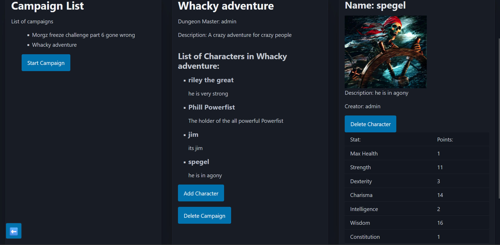

# The Design of a Database-Driven Web Application for NCEA Level 3

Project Name: **Tabletop Character Index**

Project Author: **Cameron Fitzsimmons**

Assessment Standards: **91902** and **91903**

-------------------------------------------------

## System Requirements

### Identified Need or Problem

People who play table top games often have to keep track of physical character sheets which are easily lost or destroyed. They are also very tedious to update as they eventually get smudged with erased text or scribbled out pen. It is also difficult for the game master to keep track of all of the npc's information and stats as well.

### End-User Requirements

The end users will be people who play table top games (such as Dungeons and Dragons). This will especially be useful for people who have a difficult time keeping track of physical copies or keeping documents organised. this will also be advantageous for people who have difficulties writing with a pen and paper (such as people with dyspraxia) since it will allow them to type it up instead. This website would also help Dungeon masters organise and distribute information about the campaign and characters.

### Proposed Solution

A website that acts as a database and also a sort of wikipedia for tabletop games and campaigns that people are hosting allowing users to store their information and make and manage campaigns. Users should be able to:

Create accounts with a secure password

Create a campaign that the creator of the campaign will be able to add other users to as players

Create characters that will be stored on a database and will be able to be viewed by other players (but not edited)

track and edit the stats and information about their characters

access everything from a secure database

-------------------------------------------------

## Relevant Implications

### Accessibility 

This means that everyone can user the website no matter what device they are using or if they have a disability such as color-blindness, dyslexia or a vision impairment. 

This is relevant to this website because there is a very diverse group of people who play tabletop games and could use this website and it is also very likely that users would use a mobile device or laptop rather then a PC.

I will need to make sure that as I design and evolve the website and the UI that I keep in mind what it looks on mobile and smaller screens and keep it so that the website functions and is usable on all devices. I will also have to make sure that the color tones and combinations are contrast enough that people with poor vision will be able to read them easily as well as selection a good font to use for smaller screens and that isn't hard for people to read.

### Functionality 

This means that the website works as intended and that it has a good experience for the end user in terms of serving its purpose. 

It is important for a website to work properly as intended otherwise there is no point in the website.

I will have to error test every time I update the website and let my end users use it multiple times over the course of development in order to make sure that there are no bugs or errors in my website and that everything is working as intended. 

### Usability

Usability is one of the most important implications as it involves how well the website is able to be used and accessed by its intended end-users. Usability is a very broad category but it was very clearly defined into subcategories by Jakob Nielssns with his 10 heuristics. These heuristics are: 

1: Visibility of System Status
2: Match Between the System and the Real World
3: User Control and Freedom
4: Consistency and Standards
5: Error Prevention
6: Recognition Rather than Recall
7: Flexibility and Efficiency of Use
8: Aesthetic and Minimalist Design
9: Help Users Recognize, Diagnose, and Recover from Errors
10: Help and Documentation 

Since there is already an alternative to my website (going back to pen and paper) then if I do not make the website usable or make it too difficult to understand then there is no reasons for the end-users to user my website.

I will have to make sure I follow Nielsens 10 heuristics most importantly:

-------------------------------------------------

## Relevant User Experience (UX) Principles

### User Control and Freedom

This means that when a user makes a mistake or changes their mind that they are easily able to undo that action or back out of whatever they are doing.

It is important as a user could easily choose the wrong character or for the Game master to choose the wrong npc or input the wrong information

This means that I will have to make sure that the user can easily remove/swap out characters or edit/undo information about characters/npc's once they have changed it.

### Consistency and Standards

It means that the user shouldn't have to wonder what words or symbols mean and using standard or commonly used words/symbols.

If there are lots of difficult to understand symbols and words it will make it hard for the user to understand what they are doing or how to use the website..

I will need to always remember to use simple and common symbols in order to make sure that the user can understand the website clearly and easily.

### Help Users recognise, Diagnose and Recover from Errors

Make it so that users can easily tell when someone has gone wrong with an error message and suggest a solution to the problem

If an error occurs on a website and its not clear to the user then it can be very frustrating for the user as they have no idea what is wrong or why the website is not working.

I will need to have error pages that have clear simple messages explaining what has happened and what the user can do (e.g 404 error would tell the user that the page cannot be found and that they should try refreshing or using a different page)

-------------------------------------------------

## Final System Design

### Database Structure

### User Interface Design

-------------------------------------------------

## Completed System

### Database Structure

Place a image here that shows the *actual database structure* that you implemented: tables, fields and relationships.

### User Interface Design

This shows the campaign list as well as having a campaign selected. it also shows information on a character in that campaign

This shows the character selection list and a character selected showing all of their information.

-------------------------------------------------

## Review and Evaluation

### Meeting the Needs of the Users

I met the needs of the user very well and created a website that has everything the user would need in order to keep track of characters and campaign information. there is a single easy to access tab to view and browse peoples characters and it has all of their stats on the website meaning they no longer need to use paper and pen which can get lost and damaged. Users campaigns are also tracked meaning that they are also easy to follow as it displays all the information and a description about each campaign. 

### Meeting the System Requirements

Every feature was added except for a way for characters to have combat. This was due to difficulties in actually creating and designing a working combat page due to the amount of variables that take place in combat. 

I have kept the project true to its original functionality and creating characters, accounts and campaigns works perfectly. 

I have also made sure the website works smoothly and functions properly by letting end users frequently use and test it as well as letting them create their own characters and campaigns.

### Review of Accessibility

Accessibility was a key part of design when choosing a colour scheme and making sure that the text contrast with the background in order for people with poor vision to be able to read and see it. Buttons were also made very large and obvious to further help people.

I have also developed the website so that it is able to be used on mobile and other screens of different sizes in order to ensure that the website is not only usable for people with desktops or large laptops.

As shown here there is light text with a dark background and large text in order to maximise visablility. 

This shows how the website looks on a mobile view.

### Review of Functionality

I made sure that the website works as intented and is correctly functioning as I planned. I have made sure to keep using my end users for feedback and have made sure to incorperate their feedback into the website in order to ensure that it is properly working and enjoyable to use. 

The website working as intended allowing you to look through characters and campaigns as well as creating and adding your own. 

### Review of Usability

I was very carful to make the website as usable as possible. I made sure everything was easy to understand. I always showed the system status if somthing went wrong. I did this by making clear messages when things went wrong and using obvious symbols and words such as a back arrow for return or easy to understand headers like 'campaigns' and 'characters'.

### Review of User control and freedom

This was important as if someone makes a mistake and cannot undo it then it can cause a lot of problems. I made sure to follow this by adding a back button allowing the user to go to the previous page they were on. I also added a 'Are you sure?' popup when someone tries to delete somthing just in case someone accidently clicks it.

Page with the back button

Are you sure message

### Review of Consistancy and standards

I made sure that the website was usable and clearly understandable. I made sure that it was consistant with other websites when displaying what things did or meant such as a back arrow for the back button or made sure that everything is clearly labelled. 

Examples of buttons:

### Review of Help Users recognise, diagnose and recover from errors

I added pages that tell the user what went wrong or what the error is if somthing doesnt work. Such as telling the user that they put in the wrong password, the account doesnt exist, the page doesnt exist or information is missing in the forum. 

