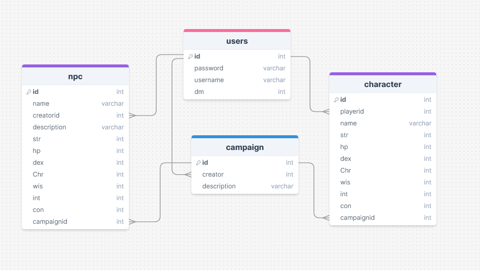
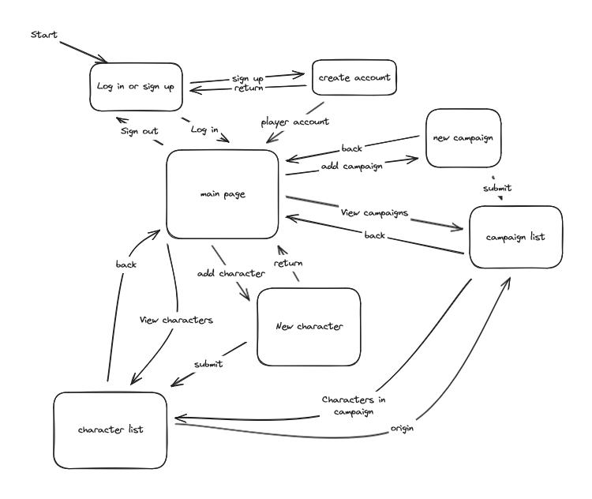
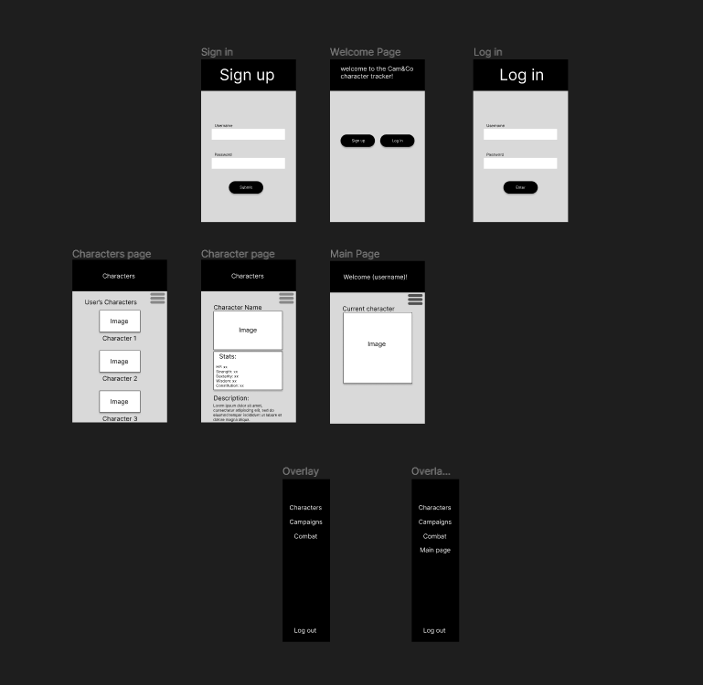
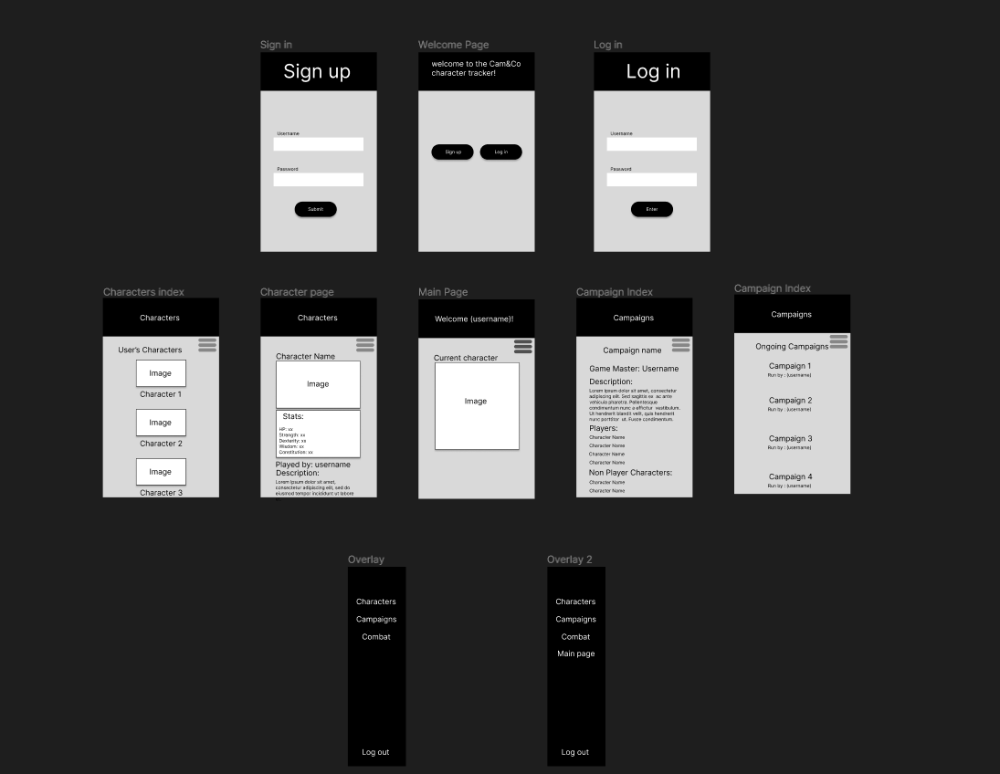
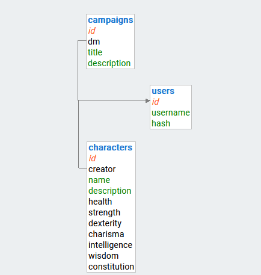
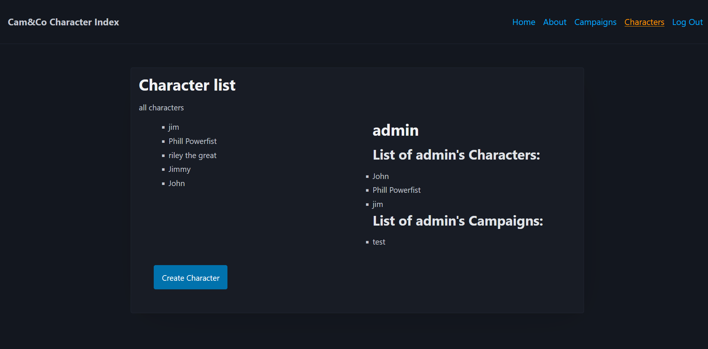

# Development of a Database-Driven Web Application for NCEA Level 3

Project Name: **Tabletop Character Index**

Project Author: **Cameron Fitzsimmons**

Assessment Standards: **91902** and **91903**

-------------------------------------------------

## Design, Development and Testing Log

### 16/05/2024

Created the first design of the database and how it would interlink

Figured out on how the database should be set up and interlink together. Got a basic idea of the layout of the website/ how it should function on a simple level.

### 17/05/2024

Making a flowchart using Excalidraw to decide the basic flow of the website

I figured how the website should interlink and flow and decided that the user should start at a sign up/in page and then be sent to a main page where everything can be accessed from that page. I also decided that there will be two types of accounts a Player account who can make playable characters and view the campaign and npc information, and a game master who can create and add players too campaigns, make and manage npc's and view player character's information.

### 28/05/2024

Started creating a figma web design for how the website will function and how the UI will look on a basic level

I started creating a figma web design for how the basic website will function in order to show the end users what kind of website it will be and how it will work. did not finish making it. 

### 31/05/2024

Finished first design of the figma version of the website

Finished off the campaign part of the Figma design and also interaction between the pages using the flow prototypes.

### 11/06/2024

talked with end users and added colour scheme aswell as small changes.

I added a color scheme to the website aswell as made some changes based on user feedback. I also added a colour scheme to the website and experimented with various colour pallots.

End users made several comments about the design of the website. They said that the text at the top of some of the screens was to small and that it made it look empty. They also commented that the welcome screen text was too cluttered. They also pointed out several small UI changes that should be made such as the pop out menu buttons overlapping on certain pages. 

I acted apon the user feedback by making the heading text larger and more centeral. I also changed the welcome page to only say "welcome". I also touched up smaller areas of the UI and added a backdrop to certain areas in order to make it less empty.

### 13/06/2024

Added a rough outline for how the database will connect

Each character will have a creator and each campaign will have a dm

### 23/07/2024

Made prototype and refining it

Ran into problems with the UI design and how it all interacts

